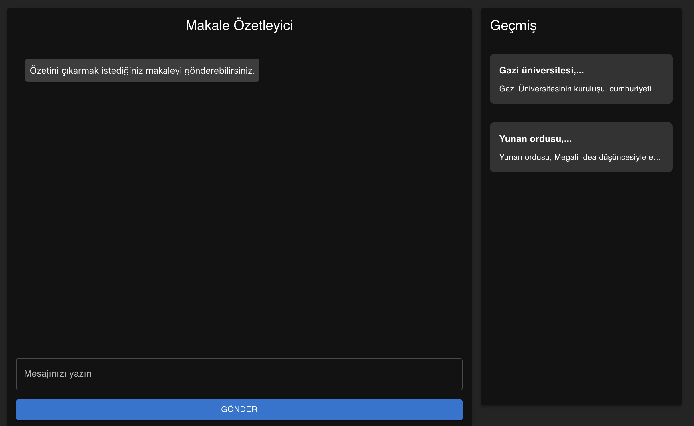
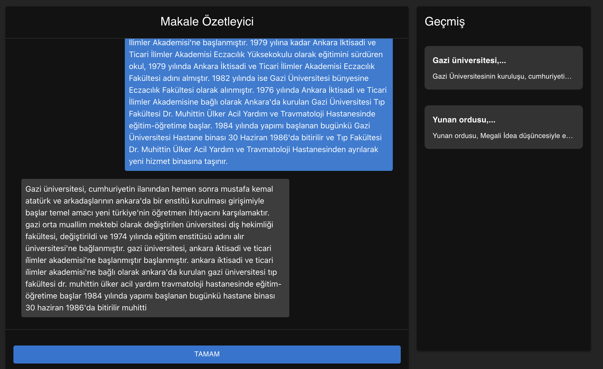

<h1 align="center">Article Summarizer</h1>


**Article Summarizer** is an application that allows users to summarize Wikipedia articles. Users can paste an article link and get a summary by submitting it to a model. The app features a chat interface where users can interact with the model, and their previous conversations are displayed on the right side. The article and its summary are saved in the **Firebase** database.





## Features
- **Article Summarization**: Users can paste Wikipedia articles and instantly get their summaries.
- **Chat History**: A sidebar on the right shows the history of all the summarization requests and conversations.
- **Firebase Integration**: Articles and their summaries are saved to the Firebase database.
- **Trained Model**: Requests from users are sent to the custom model in the ArticleSummarizerBackend repository. This model has been trained with **4000 data entries**.

## Technologies Used
- **Frontend**: React (or React Native)
- **Backend**: Custom-trained model (ArticleSummarizerBackend repository)
- **Database**: Firebase
- **Model**: Trained article summarization model (trained with 4000 data entries)

## Setup and Usage

1. **Clone the Repository**:
   ```bash
   git clone https://github.com/qrivnel/ArticleSummarizer.git